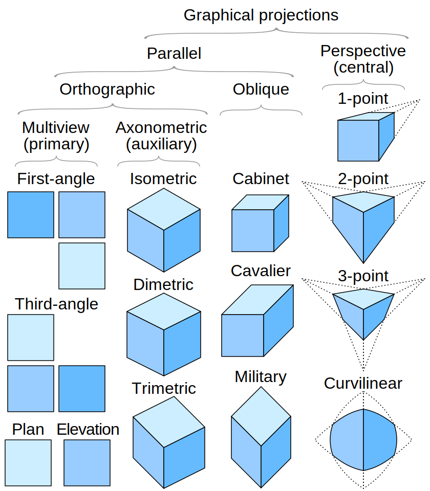

**[Calculus](https://wikipedia.org/wiki/Calculus) to produce best 2 [orthographic projection](https://wikipedia.org/wiki/Orthographic_projection)s (2D [previews](https://wikipedia.org/wiki/Viewport)) -- of [3D mesh](https://wikipedia.org/wiki/Polygon_mesh)es -- such that you can use projections to do [reconstruction of meshes](https://wikipedia.org/wiki/3D_reconstruction)**

\[[This post](./PrincipalComponentAnalysis.md) \[[<sup>2</sup>](https://swudususuwu.substack.com/p/formula-to-produce-2-orthographic)\] is [released through *Creative Commons Generic Attribution 2* (which allows all uses)](https://creativecommons.org/licenses/by/2.0/). This post is a work-in-progress, version is [SusuLib@`preview`](https://github.com/SwuduSusuwu/SusuLib/commit/preview)\]



\[**Attribution**: [cover photo (from `https://en.wikipedia.org/wiki/3D_projection`](https://commons.wikimedia.org/wiki/File:Comparison_of_graphical_projections.svg) is included through [*Fair Use* (publisher for schools).](https://k12irc.org/topics/copyright-and-fair-use/)\]

# Table of Contents
- [Discussion](#discussion)
  - [Discussion 1.2](#discussion-12)
  - [Discussion 2](#discussion-2)
  - [Discussion 2.2](#discussion-22)
- [Synopsis + similar posts](#synopsis--similar-posts)

******************************************
# Discussion
This discussion uses [`../SusuLib/posts/Physics_sims_which_structures_to_use.md#popular-structures-for-sims`](https://github.com/SwuduSusuwu/SusuPosts/blob/preview/posts/Physics_sims_which_structures_to_use.md#popular-structures-for-sims)'s definitions of *textures* + *vertices* + *meshes* + *skeletons* + *renderers*.

From [this discussion with _Assistant_](https://poe.com/s/aIw9g8FvWdIEj0fUfvdL) (+ own research to do manual insertion of [**URL**s](https://wikipedia.org/wiki/URL) to more resources):

**Q**: <https://wikipedia.org/wiki/3D_projection>

## *Assistant*'s solution
**Notice**: the *block quote* which follows was produced from the [*artificial intelligence*](https://github.com/SwuduSusuwu/SusuPosts/tree/preview/posts/ConsumerWarnings/Warning_AI_is_not_good_for_humans_to_use.md) known as [*Assistant*](https://poe.com/Assistant). Duplicate `\n`s were removed from code blocks (`` ``` ... ``` ``).
> Here are the key points about 3D projection based on the Wikipedia article:
>
> 1. Overview:
>
> - 3D projection is a design technique used to display a [3D object](https://wikipedia.org/wiki/3D_modeling) on a 2D [surface](https://wikipedia.org/wiki/Computer_representation_of_surfaces).
> - It relies on [visual perspective](https://wikipedia.org/wiki/Perspective_(graphical)) and [aspect](https://wikipedia.org/wiki/Aspect_(geography)) analysis to project a 3D object onto a [2D plane](https://wikipedia.org/wiki/Plane_(mathematics)).
> - 3D projections [use the object's basic shape to create a map of points that are connected to create a 2D visual representation](https://wikipedia.org/wiki/Rasterisation).
> - 3D projections are commonly used in [engineering](https://wikipedia.org/wiki/Engineering), [drafting](https://wikipedia.org/wiki/Drafting), and [computer graphics](https://wikipedia.org/wiki/Computer_graphics).
>
> 2. [Parallel Projection](https://wikipedia.org/wiki/Parallel_projection):
>
> - In parallel projection, the [lines of sight](https://wikipedia.org/wiki/Line_of_sight) from the object to the [projection plane ](https://wikipedia.org/wiki/Projection_plane)are parallel.
> - Parallel lines in 3D space remain parallel in the 2D projection.
> - Parallel projection corresponds to a perspective projection with an infinite [focal length](https://wikipedia.org/wiki/Focal_length).
> - Special cases of parallel projection include orthographic and oblique projection.
>
> 3. [Orthographic Projection](https://wikipedia.org/wiki/Orthographic_projection):
>
> - Orthographic projection is a type of parallel projection where the [viewing direction](https://wikipedia.org/wiki/Viewing_cone) is [perpendicular](https://wikipedia.org/wiki/Perpendicular) to the projection plane.
> - It is a 2D representation of a 3D object, commonly used in technical drawings.
>
> - The [mathematical transformation](https://wikipedia.org/wiki/Transformation_(function)) for orthographic projection parallel to the y-axis is provided.
>
> 4. [Oblique Projection](https://wikipedia.org/wiki/Oblique_projection):
>
> - Oblique projection is a type of parallel projection where the viewing direction is not perpendicular to the projection plane.
> - Specific types of oblique projection include cavalier, cabinet, and military projection.
>
> 5. [Perspective Projection](https://wikipedia.org/wiki/3D_projection#Perspective_projection):
>
> - Perspective projection involves projecting the 3D object onto the 2D plane using a finite viewpoint and focal length.
> - This results in the appearance of depth and distance, as objects further away appear smaller.
> - Weak perspective projection is a variant of perspective projection.
>
> 6. Diagrams are provided to illustrate the different types of 3D projections.
>

******************************************
## Discussion 1.2
**Q**: _Formula to use *3D projection* to produce 2 2D images which capture as much of a complex 3D object as possible? (As opposed to a 3D model viewer whose preview is always a 2D head-on preview + a 2D fixed-rotation preview)_

### *Assistant*'s solution 1.2
**Notice**: the *block quote* which follows was produced from the [*artificial intelligence*](https://github.com/SwuduSusuwu/SusuPosts/tree/preview/posts/ConsumerWarnings/Warning_AI_is_not_good_for_humans_to_use.md) known as [*Assistant*](https://poe.com/Assistant). Duplicate `\n`s were removed from code blocks (`` ``` ... ``` ``).
> To produce two 2D images that capture as much of a complex 3D object as possible, you can use a technique called [multiview projection](https://wikipedia.org/wiki/Multiview_orthographic_projection), which is a type of parallel projection.
>
> The key steps are:
>
> 1. Determine the three principal orthographic views:
>
> - Front view (or elevation)
> - Top view (or plan)
> - Side view (or profile)
>
> 2. Apply the orthographic projection formula to each principal view:
>
> Front view (elevation):
>
> ```
> x' = x
> y' = y
> z' = 0
> ```
>
> Top view (plan):
>
> ```
> x' = x
> y' = 0
> z' = z
> ```
>
> Side view (profile):
>
> ```
> x' = 0
> y' = y
> z' = z
> ```
>
> Where (x, y, z) are the coordinates of the 3D object, and (x', y', z') are the coordinates of the 2D projection.
>
> 3. Arrange the three orthographic views in a standardized layout, typically with the front view on the left, the top view above, and the side view on the right.
>
> This multiview projection technique allows you to capture the full 3D shape of a complex object using just three 2D views, without requiring a 3D model viewer. The three views together provide enough information to reconstruct the original 3D geometry.
>
> The advantage of this approach over a 3D model viewer's fixed 2D previews is that the multiview projection captures the object from multiple essential perspectives, giving a more comprehensive representation of the 3D form.

******************************************
## Discussion 2
**Q**: _Your example is 3 fixed rotations (or a head-on view plus 2 fixed rotations) to produce 3 previews, which ignores the geometric attributes of the object. Does a formula exist which processes the geometric attributes to determine the best transformations to produce 2 previews which humans can use to deduce as much of the geometric attributes as possible?_

### *Assistant*'s solution 2
**Notice**: the *block quote* which follows was produced from the [*artificial intelligence*](https://github.com/SwuduSusuwu/SusuPosts/tree/preview/posts/ConsumerWarnings/Warning_AI_is_not_good_for_humans_to_use.md) known as [*Assistant*](https://poe.com/Assistant). Duplicate `\n`s were removed from code blocks (`` ``` ... ``` ``).
> You're right, the three-view orthographic projection I described earlier is a bit limited, as it uses a fixed set of views regardless of the specific geometric attributes of the 3D object.
>
> To determine the optimal two 2D preview images that can capture more of the geometric attributes of a complex 3D object, we can use a technique called [principal component analysis](https://wikipedia.org/wiki/Principal_component_analysis) (PCA).
>
> The general formula would be:
>
> 1. Perform PCA on the 3D object's [vertex data](https://wikipedia.org/wiki/Vertex_(computer_graphics)) to determine the three principal axes of the object.
> 2. Use the first two principal axes to define the two projection planes for the 2D previews.
>
> The steps would be:
>
> 1. Collect the 3D vertex data of the object into a [matrix](https://wikipedia.org/wiki/Matrix_(mathematics)) X, where each row represents the x, y, z coordinates of a vertex.
> 2. Compute the [covariance matrix](https://wikipedia.org/wiki/Covariance_matrix) C of X:
>
> ```
> C = (X - [mean](https://wikipedia.org/wiki/Arithmetic_mean)(X))' * (X - mean(X)) / (n-1)
> ```
>
> where n is the number of vertices.
>
> 3. Find the [eigenvectors](https://wikipedia.org/wiki/Eigenvector) and [eigenvalues](https://wikipedia.org/wiki/eigenvalue) of the [covariance](https://wikipedia.org/wiki/Covariance) matrix C using SVD ([Singular Value Decomposition](https://wikipedia.org/wiki/Singular_value_decomposition)):
>
> ```
>
> [U, S, V] = svd(C)
>
> ```
>
> The columns of U are the principal axes (eigenvectors) of the 3D object.
>
> 4. Use the first two columns of U to define the two projection planes:
>
> - Projection plane 1: [normal vector](https://wikipedia.org/wiki/Normal_(geometry)) = U(:,1)
> - Projection plane 2: normal vector = U(:,2)
>
> 5. Apply orthographic projection onto these two planes to generate the two 2D preview images.
>
> The advantage of this approach is that it determines the two most informative 2D views based on the object's actual geometric shape, rather than using a fixed set of views. This can provide a more comprehensive representation of the 3D object's form, allowing users to better [deduce its geometric attributes](https://wikipedia.org/wiki/3D_reconstruction).

******************************************
## Discussion 2.2
From [this discussion with *Solar-Pro-2*](https://poe.com/s/Eyp2DR4BSTEAVkt7Z9Zd):
**Q**: Wish you produce `# Discussion 2.2` for <https://raw.githubusercontent.com/SwuduSusuwu/SusuLib/7a6839d33faa1d7175f443792d0febfe1e54e79c/posts/PrincipalComponentAnalysis.md> which shall include `java` source code which uses https://wikipedia.org/wiki/Principal_component_analysis to produce the best `n` [`Bitmap`s from some `Mesh`](https://raw.githubusercontent.com/SwuduSusuwu/SusuPosts/3d7b4cb6b94ce1e80a72d5cfba4e5b02ebf605ba/posts/Physics_sims_which_structures_to_use.md)

### *Assistant*'s solution 2.2
**Notice**: the *block quote* which follows was produced from the [*artificial intelligence*](https://github.com/SwuduSusuwu/SusuPosts/tree/preview/posts/ConsumerWarnings/Warning_AI_is_not_good_for_humans_to_use.md) known as [*Solar-Pro-2*](https://poe.com/Solar-Pro-2). Duplicate `\n`s were removed from code blocks (`` ``` ... ``` ``).
> #### Discussion 2.2: PCA-Driven Mesh to Bitmap Conversion in Java
>
> This section provides Java implementations for performing Principal Component Analysis (PCA) on 3D mesh vertex data to generate optimal 2D bitmap projections. The approach follows the Wikipedia PCA algorithm and leverages structures from the physics simulation document.
>
> ##### Core Concepts
>
> 1. **Mesh Representation**: Using vertex positions as data points
> 2. **PCA Workflow**:
>    - Compute covariance matrix
>    - Calculate eigenvalues/eigenvectors
>    - Project vertices onto principal components
> 3. **Bitmap Generation**: Orthographic projection onto top `n` principal components
>
> ```java
> import java.awt.image.BufferedImage;
> import java.util.ArrayList;
> import java.util.List;
>
> // Mesh structures from physics sims document
> class Vertex {
>     public final double[] pos = new double[3]; // x,y,z coordinates
>     public final int rgb; // Color value
>
>     public Vertex(double x, double y, double z, int color) {
>         pos[0] = x; pos[1] = y; pos[2] = z;
>         rgb = color;
>     }
> }
>
> class Mesh {
>     public final List<Vertex> vertices = new ArrayList<>();
>     public final List<int[]> faces = new ArrayList<>(); // Triangle indices
> }
>
> // PCA Implementation
> class PrincipalComponentAnalyzer {
>     private final double[][] dataMatrix; // Centered data matrix
>     private final int dimension;
>
>     public PrincipalComponentAnalyzer(double[][] rawData) {
>         this.dimension = rawData[0].length;
>         // Center the data
>         double[] means = calculateMeans(rawData);
>         dataMatrix = new double[rawData.length][dimension];
>
>         for (int i = 0; i < rawData.length; i++) {
>             for (int j = 0; j < dimension; j++) {
>                 dataMatrix[i][j] = rawData[i][j] - means[j];
>             }
>         }
>     }
>
>     private double[] calculateMeans(double[][] data) {
>         double[] means = new double[dimension];
>         for (int j = 0; j < dimension; j++) {
>             for (int i = 0; i < data.length; i++) {
>                 means[j] += data[i][j];
>             }
>             means[j] /= data.length;
>         }
>         return means;
>     }
>
>     public EigenDecomposition getPrincipalComponents() {
>         double[][] covMatrix = calculateCovarianceMatrix();
>         return new EigenDecomposition(covMatrix);
>     }
>
>     private double[][] calculateCovarianceMatrix() {
>         double[][] covMatrix = new double[dimension][dimension];
>
>         for (int i = 0; i < dimension; i++) {
>             for (int j = 0; j < dimension; j++) {
>                 double sum = 0.0;
>                 for (int k = 0; k < dataMatrix.length; k++) {
>                     sum += dataMatrix[k][i] * dataMatrix[k][j];
>                 }
>                 covMatrix[i][j] = sum / (dataMatrix.length - 1);
>             }
>         }
>         return covMatrix;
>     }
> }
>
> class EigenDecomposition {
>     private final double[][] eigenVectors;
>     private final double[] eigenValues;
>
>     public EigenDecomposition(double[][] matrix) {
>         // In practice, use a numerical library for eigenvalue decomposition
>         // This is a placeholder for demonstration purposes
>         JacobiEigenvalueSolver solver = new JacobiEigenvalueSolver(matrix);
>         eigenValues = solver.getEigenvalues();
>         eigenVectors = solver.getEigenvectors();
>     }
>
>     public double[][] getTopNEigenvectors(int n) {
>         int[][] indices = getSortedIndexDescending();
>         double[][] topVectors = new double[n][eigenVectors.length];
>
>         for (int i = 0; i < n; i++) {
>             int idx = indices[i][1];
>             System.arraycopy(eigenVectors[idx], 0, topVectors[i], 0, eigenVectors[idx].length);
>         }
>         return topVectors;
>     }
>
>     private int[][] getSortedIndexDescending() {
>         // Implementation omitted - would sort eigenvalues descending
>         return new int[0][0]; // Placeholder
>     }
> }
>
> // Bitmap Generation from PCA
> class PcaMeshRenderer {
>     private static final int BITMAP_SIZE = 256;
>     private static final double SCALE_FACTOR = 100.0; // Scaling for visualization
>
>     public static List<BufferedImage> generatePrincipalComponentBitmaps(Mesh mesh, int topN) {
>         List<BufferedImage> bitmaps = new ArrayList<>();
>
>         // Extract vertex positions as data matrix
>         double[][] vertexData = new double[mesh.vertices.size()][3];
>         for (int i = 0; i < mesh.vertices.size(); i++) {
>             Vertex v = mesh.vertices.get(i);
>             vertexData[i][0] = v.pos[0];
>             vertexData[i][1] = v.pos[1];
>             vertexData[i][2] = v.pos[2];
>         }
>
>         // Perform PCA
>         PrincipalComponentAnalyzer analyzer = new PrincipalComponentAnalyzer(vertexData);
>         EigenDecomposition decomposition = analyzer.getPrincipalComponents();
>         double[][] topVectors = decomposition.getTopNEigenvectors(topN);
>
>         // Generate bitmap for each principal component
>         for (int i = 0; i < topN; i++) {
>             BufferedImage bitmap = new BufferedImage(BITMAP_SIZE, BITMAP_SIZE, BufferedImage.TYPE_INT_RGB);
>
>             // Project vertices onto this principal component
>             for (int j = 0; j < mesh.vertices.size(); j++) {
>                 Vertex v = mesh.vertices.get(j);
>                 double[] pos = v.pos;
>
>                 // Calculate position in 2D bitmap coordinates
>                 int x = (int) ((pos[0] * topVectors[i][0] + pos[1] * topVectors[i][1] + pos[2] * topVectors[i][2]) * SCALE_FACTOR + BITMAP_SIZE/2);
>                 int y = (int) ((pos[0] * topVectors[(i+1)%3][0] + pos[1] * topVectors[(i+1)%3][1] + pos[2] * topVectors[(i+1)%3][2]) * SCALE_FACTOR + BITMAP_SIZE/2);
>
>                 // Clamp to bitmap boundaries
>                 if (x >= 0 && x < BITMAP_SIZE && y >= 0 && y < BITMAP_SIZE) {
>                     bitmap.setRGB(x, y, v.rgb);
>                 }
>             }
>
>             bitmaps.add(bitmap);
>         }
>
>         return bitmaps;
>     }
>
>     // Simple Jacobi Eigenvalue Solver (for demonstration purposes)
>     static class JacobiEigenvalueSolver {
>         private double[][] matrix;
>         private double[][] eigenVectors;
>         private double[] eigenValues;
>
>         public JacobiEigenvalueSolver(double[][] matrix) {
>             this.matrix = copyMatrix(matrix);
>             int n = matrix.length;
>             eigenVectors = new double[n][n];
>             eigenValues = new double[n];
>
>             // Initialize eigenvectors to identity matrix
>             for (int i = 0; i < n; i++) {
>                 for (int j = 0; j < n; j++) {
>                     eigenVectors[i][j] = (i == j) ? 1.0 : 0.0;
>                 }
>             }
>
>             jacobi(n, matrix, eigenValues, eigenVectors, 50); // Max 50 iterations
>         }
>
>         public double[] getEigenvalues() {
>             return eigenValues;
>         }
>
>         public double[][] getEigenvectors() {
>             return eigenVectors;
>         }
>
>         // Jacobi algorithm implementation
>         private void jacobi(int n, double a[][], double[] d, double v[][], int maxSweeps) {
>             for (int sweeps = 0; sweeps < maxSweeps; sweeps++) {
>                 int ip = 0;
>                 int iq = 1;
>                 double max = 0.0;
>
>                 // Find largest off-diagonal element
>                 for (int p = 0; p < n-1; p++) {
>                     for (int q = p+1; q < n; q++) {
>                         if (Math.abs(a[p][q]) > max) {
>                             max = Math.abs(a[p][q]);
>                             ip = p;
>                             iq = q;
>                         }
>                     }
>                 }
>
>                 if (max < 0.0000001) break; // Convergence criteria
>
>                 // Apply rotation to zero the element
>                 double t = (a[iq][iq] - a[ip][ip]) / (2 * a[ip][iq]);
>                 double phi;
>                 if (t < 0) {
>                     phi = -Math.acos(t) / 2;
>                 } else {
>                     phi = Math.acos(t) / 2;
>                 }
>
>                 double c = Math.cos(phi);
>                 double s = Math.sin(phi);
>
>                 // Rotate matrix
>                 double aii = a[ip][ip];
>                 double aiq = a[ip][iq];
>                 double aqq = a[iq][iq];
>
>                 double g = a[ip][ip] = aii * c*c + aqq * s*s - 2 * aiq * s * c;
>                 a[iq][iq] = aqq * c*c + aii * s*s + 2 * aiq * s * c;
>                 a[ip][iq] = a[iq][ip] = (aii - aqq) * s * c + aiq * (c*c - s*s);
>
>                 // Rotate eigenvectors
>                 for (int j = 0; j < n; j++) {
>                     double vi = v[j][ip];
>                     double vq = v[j][iq];
>                     v[j][ip] = vi * c + vq * s;
>                     v[j][iq] = -vi * s + vq * c;
>                 }
>
>                 // Rotate rest of matrix
>                 for (int p2 = 0; p2 < n; p2++) {
>                     if (p2 != ip && p2 != iq) {
>                         double aip = a[ip][p2];
>                         double aiq = a[iq][p2];
>                         a[ip][p2] = a[p2][ip] = aip * c + aiq * s;
>                         a[iq][p2] = a[p2][iq] = -aip * s + aiq * c;
>                     }
>                 }
>             }
>
>             // Copy diagonal as eigenvalues
>             for (int i = 0; i < n; i++) {
>                 d[i] = a[i][i];
>             }
>         }
>
>         private double[][] copyMatrix(double[][] matrix) {
>             int rows = matrix.length;
>             int cols = matrix[0].length;
>             double[][] copy =
> ```

this message (from *Solar-Pro-2*) was truncated: *Solar-Pro-2*'s [limited](https://sourceforge.net/software/compare/Grok-vs-OpenAI-vs-Solar-Pro-2/) [inference](https://www.tensorflow.org/guide/keras/training_with_built_in_methods#introduction) context [window](https://www.tensorflow.org/api_docs/cc/class/tensorflow/tensor-buffer#size) does not show the whole source code to use.

# Synopsis + similar posts
Resources have to do with rasterization, which has uses with: [`./OuroborosSinCos.md`](./OuroborosSinCos.md)

